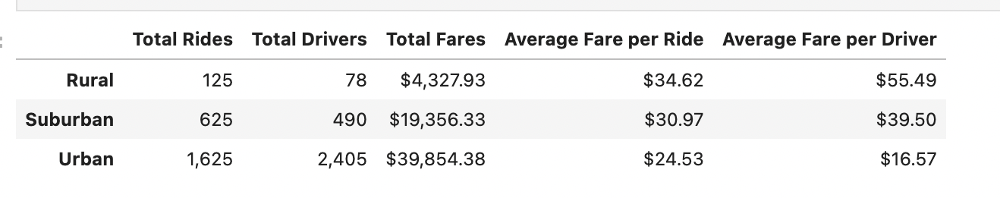

# PyBer_Analysis

## Overview 
In this module, an analysis of PyBer data was performed with Python, Pandas, and Matplotlib. For this challenge, we created a new DataFrame for the summary of ride-sharing data by city type. We then used Pandas and Matplotlib to create a multi-line graph to show the weekly fares for each city type. 

## Resources 
Data Sources: city_data.csv, ride_data.csv
Software: Python 3.9.7, Jupyter Notebook

## Results 
### Deliverable 1 
For deliverable 1, we created a new DataFrame for a summary of total ride, total drivers, total fares, average fares per ride, and average fares per driver. 

### Deliverable 2 
For deliverable 2, we created a line graph to show the relationship between fares by week for all city types. We can see that the fares are clearly divided between city types. There are more rides and drivers in urban areas, which makes sense for the difference from rural data. All city types show a peak around the beginning of March. 

## Summary 
* I would reccomend performing additional analysis for the time of day a ride is requested. Are rides requested more in the mornings, to get to work, or late at night to go out. Depending on the outcome, Pyber could offer incentives (like happy hour pricing) to get more rides during the low hours of the day. 
* I would suggest looking at the length of rides per city type. Offer incentives or new feautures like being able to pick up a friend on your way to the destination. This could potientally get a longer ride, resulting in a higher fare. 
* 
